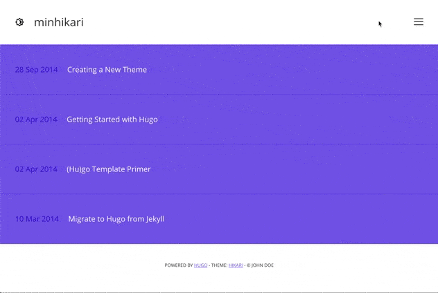
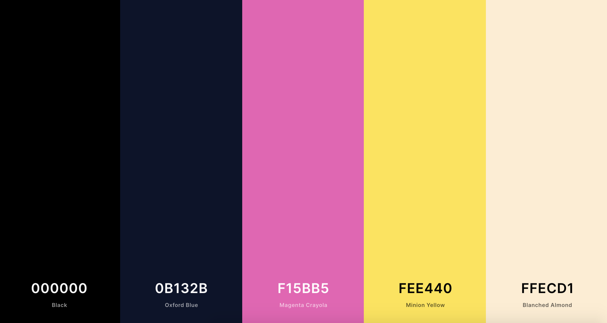

# Minhikari theme

Minhikari (for **min**imal **hikari**) is a fork of [Hikari theme](https://github.com/digitalcraftsman/hugo-hikari-theme.git) for hugo by [digitalcraftsman](https://github.com/digitalcraftsman). Hikari is currently deprecated so I'm maintaining Minhikari with new features for my own usage. Please note that some parts of this README are still the same than the original Hikari repository.



New features:

- Dark/Light theme

## Hikari theme description

Hikari is a simple theme for bloggers, whose minimalism tries to focus readers on the content. It's a port of [Mathieu Mayer-Mazzoli](//github.com/mx3m)'s orignal [Hikari theme](//github.com/mx3m/hikari-for-Jekyll) made for Jekyll. Noteworthy features are the integration of a comment-system powered by Disqus, optional statistics via Google Analytics, support for RSS and syntax highlighting for source code in blog posts.

## Installation

Inside the folder of your Hugo site run:

```bash
mkdir themes
cd themes
git clone https://github.com/epsxy/minhikari.git
```

For more information read the official [setup guide](//gohugo.io/overview/installing/) of Hugo.

## Setup

### The config file

Take a look inside the [`exampleSite`](//github.com/epsxy/minhikari/tree/dev/exampleSite) folder of this theme. You'll find a file called [`config.toml`](//github.com/epsxy/minhikari/blob/dev/exampleSite/config.toml).

To use it, copy the [`config.toml`](//github.com/epsxy/minhikari/blob/dev/exampleSite/config.toml) in the root folder of your Hugo site. Feel free to change strings as you like to customize your website.


### Disqus

This theme features a comment system powered by Disqus too. Just add your Disqus-shortname to the [`config.toml`](//github.com/epsxy/minhikari/blob/dev/exampleSite/config.toml) and let readers respond to your blog posts.


### Google Analytics

In order to get statistics about your blog and it's visitors, just enter your tracking code in the corresponding field in the [configs](//github.com/epsxy/minhikari/blob/dev/exampleSite/config.toml). As with Disqus, the use of Google Analytics is completely optional.


### Run

In order to see your site in action, run Hugo's built-in local server. 

```bash
hugo server
```

Now enter [`localhost:1313`](http://localhost:1313) in the address bar of your browser.


### Dark theme colors



## Contributing

Did you found a bug or got an idea for a new feature? Feel free to use the [issue tracker](//github.com/epsxy/minhikari/issues) to let me know. Or make directly a [pull request](//github.com/epsxy/minhikari/pulls).

Please create a separate branch for each pull request.


## License

This theme is released under the MIT license. For more information read the [License](//github.com/epsxy/minhikari/blob/master/LICENSE.MD).


## Annotations

Thanks to 

- [digitalcraftsman](//github.com/digitalcraftsman) for porting the original Hikari theme to hugo.
- [Mathieu Mayer-Mazzoli](//github.com/mx3m) for creating this theme
- [Steve Francia](//github.com/spf13) for creating Hugo and the awesome community around the project.

